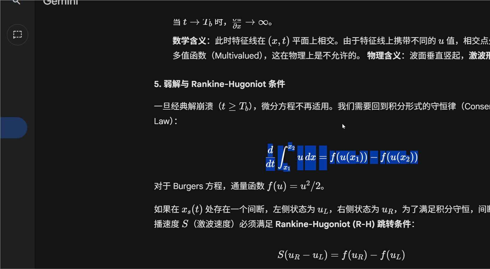

# tiptap-novel-math

[English](./README.md) | [简体中文](./README_zh-CN.md)

[](https://github.com/Sithcighce/tiptap-novel-math/actions/workflows/ci.yml)
[](https://www.npmjs.com/package/tiptap-novel-math)
[](./LICENSE)

A Notion-like, interactive mathematical formula extension for [Tiptap](https://tiptap.dev) and [Novel](https://novel.sh).

<p align="center">
  
</p>

🎮 **[Live Demo](https://sithcighce.github.io/tiptap-novel-math/)**

This extension provides a seamless "Click to Edit" experience for LaTeX math formulas, supporting both inline (`$E=mc^2$`) and block (`$$...$$`) equations.

## Features

- 🖱️ **Interactive Editing**: Click any formula to open a popover editor with live preview.
- ⌨️ **Input Rules**:
  - Type `$$` + `Space` to insert a block equation.
  - Type `$E=mc^2$` to automatically convert to an inline equation.
- 📋 **Smart Paste**: Automatically detects LaTeX patterns in pasted text and converts them to math nodes.
- 🤖 **AI Paste Support**: Robustly handles content pasted from LLMs (ChatGPT, DeepSeek), normalizing `\(...\)` and `\[...\]` formats automatically.
- 📝 **Markdown Serialization**: Seamlessly integrates with `tiptap-markdown` to export formulas as standard LaTeX (`$E=mc^2$`).
- 🔄 **Block/Inline Toggle**: Easily switch between display modes.
- 🎨 **Zero Styles**: Uses standard Tailwind classes and unstyled primitives (Radix UI) for maximum customizability.

## Installation

```bash
npm install tiptap-novel-math katex
# Peer dependencies
npm install @tiptap/core @tiptap/react react react-dom
```

## Styles

### With Tailwind CSS (recommended)

If your project uses Tailwind CSS, you just need to import KaTeX CSS:

```tsx
import "katex/dist/katex.min.css";
```

### Without Tailwind CSS

If your project does NOT use Tailwind CSS, you need to import our fallback styles as well:

```tsx
import "katex/dist/katex.min.css";
import "tiptap-novel-math/styles.css";
```

### Customization

You can customize the appearance by overriding CSS variables:

```css
:root {
  --tnm-bg-hover: #f1f5f9;
  --tnm-ring-color: #000000;
  --tnm-popover-bg: #ffffff;
  --tnm-btn-primary-bg: #0f172a;
  /* See src/styles.css for all available variables */
}
```

## Usage

Add the extension to your Tiptap editor configuration:

```tsx
import { EditorContent, useEditor } from "@tiptap/react";
import StarterKit from "@tiptap/starter-kit";
import { Mathematics, MarkdownLatexParser } from "tiptap-novel-math";
import "katex/dist/katex.min.css";

const Editor = () => {
  const editor = useEditor({
    extensions: [
      StarterKit,
      Mathematics, // The main extension
      MarkdownLatexParser, // Optional: legacy support for complex paste scenarios
    ],
    content: "<p>Type $E=mc^2$ to see magic!</p>",
  });

  return <EditorContent editor={editor} />;
};
```

## Toolbar Button

You can easily add a button to toggle math mode:

```tsx
const MathButton = ({ editor }) => {
  if (!editor) return null;

  return (
    <button
      onClick={() => {
        const { from, to } = editor.state.selection;
        const latex = editor.state.doc.textBetween(from, to);
        
        if (!editor.isActive("math")) {
            editor.chain().focus().setLatex({ latex }).run();
        } else {
            editor.chain().focus().unsetLatex().run();
        }
      }}
    >
      ∑ Math
    </button>
  );
};
```

## Contributing

Contributions are welcome! Please see [CONTRIBUTING.md](./CONTRIBUTING.md) for more details.

## License

MIT
